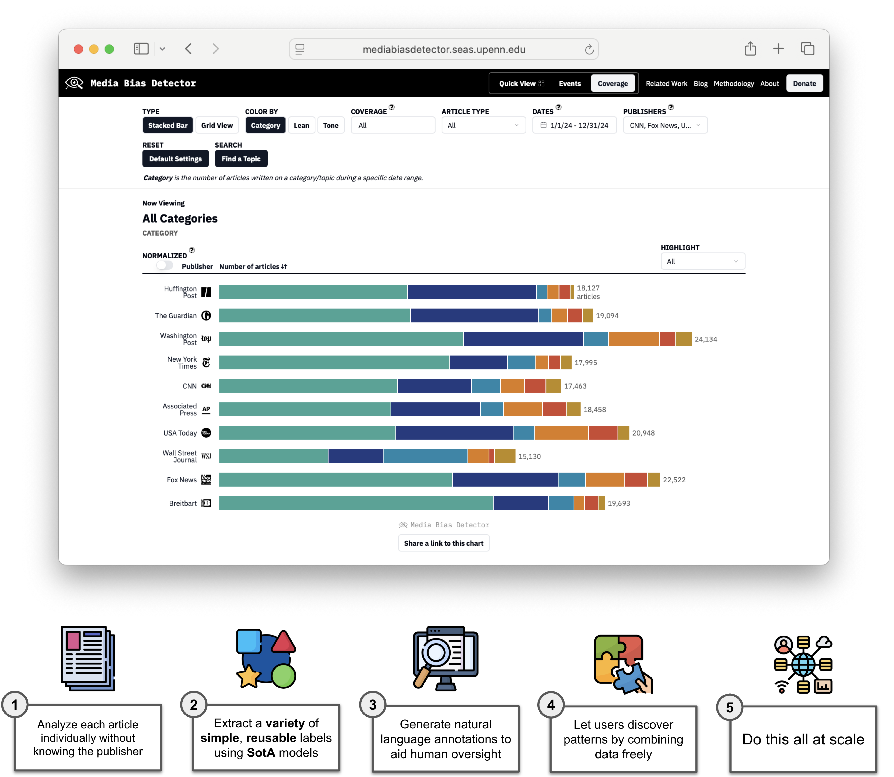

# The Media Bias Detector: A Framework for Annotating and Analyzing the News at Scale

[](https://mediabiasdetector.seas.upenn.edu/)

### Introduction

Mainstream news organizations shape public perception not only directly through the articles they publish but also through the choices they make about which topics to cover (or ignore) and how to frame the issues they do decide to cover. However, measuring these subtle forms of media bias at scale remains a challenge. Here, we introduce a large, ongoing (from January 1, 2024 to present), near real-time dataset and computational framework developed to enable systematic study of selection and framing bias in news coverage. Our pipeline integrates large language models (LLMs) with scalable, near-real-time news scraping to extract structured annotations across hundreds of articles per day. In addition to a curated dataset, we also release an interactive web platform for convenient exploration of these data. Together, these contributions establish a reusable methodology for studying media bias at scale, providing empirical resources for future research. Leveraging the breadth of the corpus over time and across publishers, we also present some examples (focused on the 150,000+ articles examined in 2024) that illustrate how this novel data set can reveal insightful patterns in news coverage and bias, supporting academic research and real-world efforts to improve media accountability.

Visit [mediabiasdetector.seas.upenn.edu](https://mediabiasdetector.seas.upenn.edu/) to explore our data via an interactive dashboard!


### Repository Structure

```
.
├── annotations/                                   # Human validation labels
│   ├── articles/                                  # Article-level annotations
│   ├── events/                                    # Event-level annotations
│   └── sentences/                                 # Sentence-level annotations
├── code/                                          
│   ├── findings.ipynb                             # Code for conducting data analysis and generating results in the paper
│   └── validation.ipynb                           # Code for computing data validation results in the paper
└── data/                                          
    └── labeled_data_10_publishers_2024.csv        # Main dataset of 150,000+ labeled articles from 10 publishers in 2024                 
```

### Dataset Schema

| Column Name | Data Type | Description |
|-------------|-----------|-------------|
| `article_id` | String | Unique identifier for each news article |
| `url` | String | Original URL of the news article |
| `publisher_full` | String | Full name of the news publisher (e.g., "Associated Press") |
| `datetime` | String | Article publication timestamp in ISO format with timezone |
| `publish_date` | String | Alternative publication date field |
| `takeaways` | String | Summary of key points from the article |
| `category` | String | High-level content category (e.g., "Politics", "Culture and Lifestyle") |
| `topic` | String | Specific topic within the category (e.g., "Immigration", "Arts and Entertainment") |
| `subtopic` | String | More granular subject classification (e.g., "Asylum and Refugees", "TV Industry") |
| `news_type` | String | Type of news content (e.g., "news report") |
| `justification` | String | Explanation for the news type classification |
| `article_lean` | Integer | Political lean score for the entire article from -5 (pro-Democrat) to +5 (pro-Republican) |
| `reason_article_lean` | String | Explanation for the article lean score |
| `article_tone` | Integer | Overall tone score for the article from -5 (negative) to +5 (positive) |
| `reason_article_tone` | String | Explanation for the article tone score |
| `title_lean` | Integer | Political lean score for the article title from -5 (pro-Democrat) to +5 (pro-Republican) |
| `reason_title_lean` | String | Explanation for the title lean score |
| `title_tone` | Integer | Tone score for the article title |
| `reason_title_tone` | String | Explanation for the title tone score from -5 (negative) to +5 (positive) |
| `publisher` | String | Shortened publisher name (e.g., "apnews") |
| `yearmo` | String | Year and month in YYYY-MM format |
| `sent_tone_neg` | Integer | Number of sentences with negative tone |
| `sent_tone_neu` | Integer | Number of sentences with neutral tone |
| `sent_tone_pos` | Integer | Number of sentences with positive tone |
| `sent_type_fac` | Integer | Number of factual sentences |
| `sent_type_opn` | Integer | Number of opinion sentences |
| `sent_type_bor` | Integer | Number of borderline sentences |
| `sent_type_quo` | Integer | Number of quote sentences |
| `sent_type_oth` | Integer | Number of other sentence types |
| `sent_focus_dem` | Integer | Number of sentences focused on Democratic figures |
| `sent_focus_rep` | Integer | Number of sentences focused on Republican figures |
| `sent_focus_bth` | Integer | Number of sentences focused on figures from both parties |
| `sent_focus_non` | Integer | Number of sentences with no partisan focus |

---

<p align="center" style="font-size: 14px; color: #666;">
  © 2025 <a href="https://css.seas.upenn.edu/" target="_blank">Computational Social Science
Lab at Penn</a>.
</p>