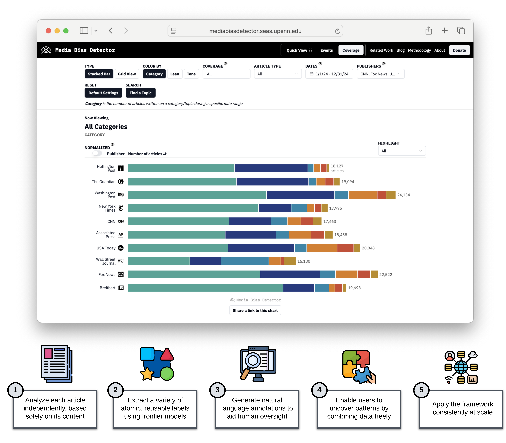

# The Media Bias Detector: A framework for annotating and analyzing the news

[](https://mediabiasdetector.seas.upenn.edu/)

### Introduction

News organizations introduce bias into their coverage via the choices they make about which topics to cover (or ignore) and how to frame the issues they do decide to cover. Here, we introduce the Media Bias Detector, a scalable computational framework that integrates large language models (LLMs) with near-real-time news scraping to extract structured annotations—including political lean, tone, topics, article type, and major events—across hundreds of articles per day. We quantify these dimensions of coverage at multiple levels—the sentence level, the article level, and the publisher level—expanding the ways in which researchers can analyze selection and framing bias in the modern news landscape. We also release an interactive web platform for convenient exploration of these data and an accompanying dataset covering more than 140,000 articles published in 2024 by ten prominent publishers. Finally, we present some results derived from this dataset that illustrate how the MBD can uncover correlates of bias in news coverage.

Visit [mediabiasdetector.seas.upenn.edu](https://mediabiasdetector.seas.upenn.edu/) to explore our data via an interactive dashboard!

### Usage

To download the code and data, run the following command in your terminal:

```
git clone https://github.com/Watts-Lab/media-bias-detector
```

### Repository Structure

```
.
├── annotations/                                   # Human validation labels
│   ├── articles/                                  # Article lean, tone, and type annotations
│   ├── events/                                    # Event theme annotations
│   ├── sentences/                                 # Sentence type, tone, and focus annotations
│   └── topics/                                    # Article topic and subtopic annotations
├── code/                                          
│   ├── findings.ipynb                             # Code for conducting data analysis and generating results in the paper
│   └── validation.ipynb                           # Code for computing data validation results in the paper
└── data/                                          
    └── labeled_data_10_publishers_2024_v1.csv     # Main dataset of 140,000+ labeled articles from 10 publishers in 2024                 
```

### Dataset Schema

| Column Name | Data Type | Description |
|-------------|-----------|-------------|
| `article_id` | String | Unique identifier for each news article |
| `url` | String | Original URL of the news article |
| `url_clean` | String | Normalized URL of the news article |
| `publisher_full` | String | Full name of the news publisher (e.g., "Associated Press") |
| `datetime` | String | Article publication timestamp in ISO format with timezone |
| `takeaways` | String | Summary of key points from the article |
| `category` | String | High-level content category (e.g., "Politics", "Culture and Lifestyle") |
| `topic` | String | Specific topic within the category (e.g., "Immigration", "Arts and Entertainment") |
| `subtopic` | String | More granular subject classification (e.g., "Asylum and Refugees", "TV Industry") |
| `news_type` | String | Type of news content (e.g., "news report") |
| `reason_news_type` | String | Explanation for the news type classification |
| `article_lean` | Integer | Political lean score for the article text from -5 (pro-Democrat) to +5 (pro-Republican) |
| `reason_article_lean` | String | Explanation for the article lean score |
| `article_tone` | Integer | Tone score for the article text from -5 (negative) to +5 (positive) |
| `reason_article_tone` | String | Explanation for the article tone score |
| `title_lean` | Integer | Political lean score for the article title from -5 (pro-Democrat) to +5 (pro-Republican) |
| `reason_title_lean` | String | Explanation for the title lean score |
| `title_tone` | Integer | Tone score for the article title from -5 (negative) to +5 (positive) |
| `reason_title_tone` | String | Explanation for the title tone score |
| `sent_tone_neg` | Integer | Number of sentences with negative tone |
| `sent_tone_neu` | Integer | Number of sentences with neutral tone |
| `sent_tone_pos` | Integer | Number of sentences with positive tone |
| `sent_type_fac` | Integer | Number of factual sentences |
| `sent_type_opn` | Integer | Number of opinion sentences |
| `sent_type_bor` | Integer | Number of borderline sentences |
| `sent_type_quo` | Integer | Number of quote sentences |
| `sent_type_oth` | Integer | Number of other sentence types |
| `sent_focus_dem` | Integer | Number of sentences focused on Democratic figures |
| `sent_focus_rep` | Integer | Number of sentences focused on Republican figures |
| `sent_focus_bth` | Integer | Number of sentences focused on figures from both parties |
| `sent_focus_non` | Integer | Number of sentences with no partisan focus |

---

<p align="center" style="font-size: 14px; color: #666;">
  © 2025 <a href="https://css.seas.upenn.edu/" target="_blank">Computational Social Science
Lab at Penn</a>.
</p>
